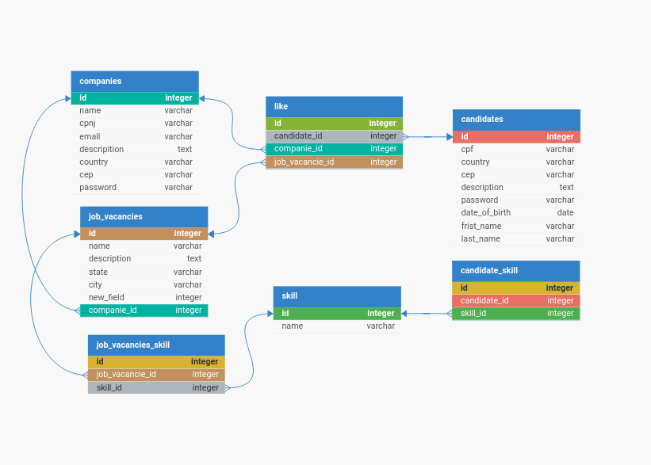

# Linketinder

## DESCRIÇÃO
Linketinder é uma plataforma inovadora que combina a familiaridade e a simplicidade do Tinder com o profissionalismo e networking do LinkedIn, oferecendo uma abordagem revolucionária para recrutamento anônimo. Projetada para profissionais em busca de oportunidades de carreira e empregadores em busca de talento,linketinder redefine a maneira como as conexões profissionais são feitas e mantidas.

## Modelagem do Banco de Dados
DB Designer

## COMO RODAR
1. Faça o clone da apliação
2. Navegue até o diretório `src`
3. Efim execulte
```bash
groovy App.groovy 
```
<!-- Pedro Jonas Nunes de Araújo -->
