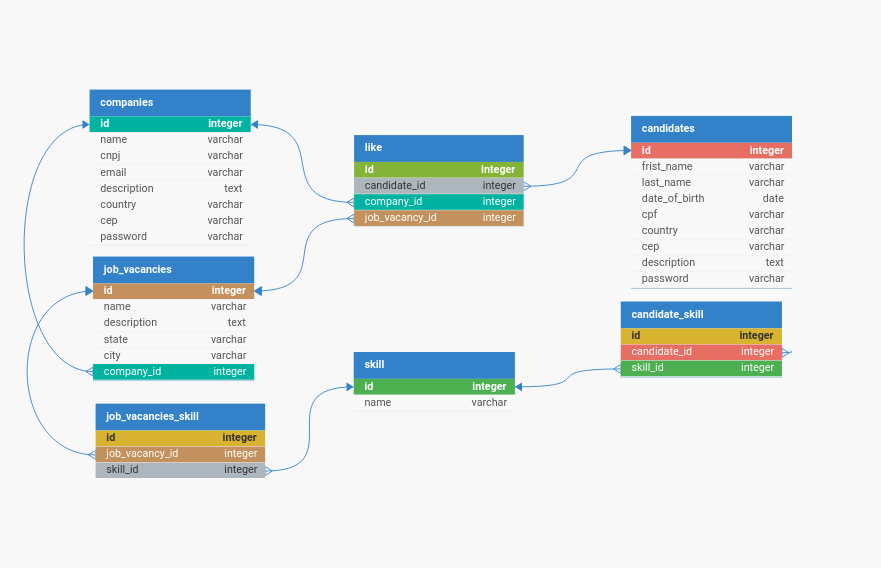

# Linketinder

## DESCRIÇÃO
Linketinder é uma plataforma inovadora que combina a familiaridade e a simplicidade do Tinder com o profissionalismo e networking do LinkedIn, oferecendo uma abordagem revolucionária para recrutamento anônimo. Projetada para profissionais em busca de oportunidades de carreira e empregadores em busca de talento,linketinder redefine a maneira como as conexões profissionais são feitas e mantidas.

## Modelagem do Banco de Dados
DB Designer

## COMO RODAR
1. Faça o clone da apliação
2. Navegue até o diretório do projeto
3. Execulte
```bash
gradle build
```~]1ç 
4. Enfim execulte
```bash
gradle run
```
## Melhorias de Refatorção
1. Criação de Testes
2. Criação de Interfaces
3. Separação de Responsabilidades
4. Aplicação de princípios SOLID
5. Adoção do padrão Factory
- Para facilitar a integração de bancos de dados diferentes sem quebrar a apliação
6. Adoção do padrão Singleton
- Garantindo que existe apenas uma conexão com o banco de dados e que seja instaciada a partir da mesma
<!-- Pedro Jonas Nunes de Araújo -->
